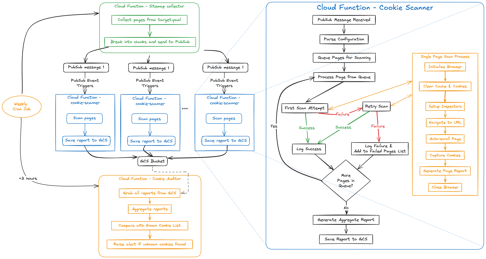

# Sentry Watchdog


Sentry took a stand of removing all 3rd party cookies and trackers from our public websites in 2024.
- [We removed advertising cookies and here’s what happened - Matt Henderson](https://blog.sentry.io/we-removed-advertising-cookies-heres-what-happened/)
- [Navigating Cookies at Sentry: A Legal Perspective - Loretta Lau](https://blog.sentry.io/navigating-cookies-at-sentry-a-legal-perspective/)
- [Removing ad trackers and cookies - the technical perspective - Jeffrey Hung](https://blog.sentry.io/removing-ad-trackers-and-cookies-the-technical-perspective/)
- [Sentry Cookie Bounty](https://sentry.io/cookiebounty/)

Watchdog is a tool that we use to help us achieve the goal, which scans for cookies and trackers on our public sites on a weekly basis. Watchdog is built on top of [blacklight-collector from the Markup](https://github.com/the-markup/blacklight-collector/tree/main?tab=readme-ov-file). For more information about the `blacklight-collector` please read [their blog](https://themarkup.org/blacklight/2020/09/22/how-we-built-a-real-time-privacy-inspector).

## Configs

### Scanner Config
Scanner-related configurations are defined in [scanner_config.yaml](./scanner_config.yaml), which determines how the scanner will scan your page. You can find a list of all the [available configurations here](https://github.com/the-markup/blacklight-collector/tree/main?tab=readme-ov-file#collector-configuration) for scanner-related options. You can also control how many pages you want to scan simultaneously and how many pages each chunk should have. Default vaules will be used if configs are not provided.

You should adjust them accordingly, depends on how many pages you have and how much resource you want to spend on the cloud function.
```yaml
title: Sentry Cookie Scanner
scanner:
  headless: false
  numPages: 0
  captureHar: false
  saveScreenshots: false
  emulateDevice:
    viewport:
      height: 1920
      width: 1080
    userAgent: "Mozilla/5.0 (Windows NT 10.0; Win64; x64) AppleWebKit/537.36 (KHTML, like Gecko) Chrome/132.0.0.0 Safari/537.3"

# Note: pubsub message expires after 10 minutes, so we want to keep each chunk under 10 minutes
maxConcurrent: 40 # number of concurrent scans
chunkSize: 120 # number of pages to scan per chunk
```
### Target pages
[target.yaml](./target.yaml) is where you define the pages you want to scan, it can include sitemaps, rss feeds, or individual pages. 
```yaml
sitemaps:
  - https://sentry.io/sitemap/sitemap-0.xml
rss:
  - https://sentry.io/changelog/feed.xml
pages:
  - https://status.sentry.io
```
### Known Cookies
[known_cookies.json](./known_cookies.json) is where we define what we considered as known cookies. Any cookie(s) or tracker(s) in the list is consided as authorized and will not be triggering any alert. The URL list under each cookie item doesn't matter, it's just a snapshot of the URLs that has that cookie when the json file is generated.

```json
{
  "cookies":{
    "cookie_name/domain":[
      "page1.com",
      "page2.com"
    ]
  },
  "third_party_trackers":{
    "tracker_1":[
      "page1.com"
    ],
    "tracker_2":[
      "page2.com"
    ]
  }
}
```


## Infrastructure
The infrastructure is build using the template from [secure-cloud-function-template](https://github.com/getsentry/secure-cloud-functions-template) using terraform.

Watchdog contains 3 cloud functions, each has their own readme file with more details
- [sitemap-collector](./functions/sitemap-collector/)
- [cookie-scanner](./functions/cookie-scanner/)
- [cookie-auditor](./functions/cookie-auditor/)

Besides cloud functions, terraform also creates [Pub/Sub Subscription and topic](./pubsubs/page-scanning-pubsub/) and a [GCS bucket](./gcs/aggregated_reports_storage/) for triggering events and storing reports.

### Flow


### Deployement

Update `terraform.tfvars` with your configs, make sure you are auth to GCP, then run the following to deploy the infrastructure and all the cloud functions.
You may need to re-run terraform apply several times to get everything deployed in place.

```
terraform init
terraform plan
terraform apply
```

> GCS bucket access: we enabled `uniform_bucket_level_access` for the GCS buckets created by terraform, hence your will need explicit access to the buckets to update it after they are created, being `owner` of the GCP project will not be sufficient. You can either:
> 1.  Add yourself as `maintainers` in `terraform.tfvars`, which will allow you to impersonate the deployment service account, and use the service account for deployment.
> 2. Update the terraform and grant yourself explicit access to the GCS buckets.

### Secrets Management
Secret is a tricky item, we don't want to hardcode the secret values in Terraform for obvious reasons, but we do want to manage everything else like access in code, hence we take a special approach. We create the secret in Terraform [here](/infrastructure/secrets.tf), but not the value, which will need to be added to GCP Secret Manager after the secret was created by Terraform.
Because of this, if you try to create a secret and add it to resources (e.g. cloud function) in one terraform apply, it will guarantee to fail because the secret has no value available. There's a few workarounds for this: 
1. Separate the changes to multiple terraform apply: First create the secret and apply changes, next manually add the value to it in GCP console, then make changes to resources that need access to the secret
2. Rerun terraform apply after failure: Do everything in one terraform apply and expect it to fail, even with the failure terraform should still create the secret. Manually add the secret value in GCP console, then re-run the same terraform apply, this time it should pass with no error.
3. [For people who are fast at clicking buttons] Add secret value during terraform apply: while terraform is applying, there will be a time gap between secret being created and resources getting access to it, depends on how big your terraform is it can be something like a few seconds to a few minutes. You can technically monitor the terraform apply log closely and once you see the secret is created, go to GCP console and add the value to it immediately, and if you are fast enough you will have the secret value ready before terraform gets to secret <> resource binding :) 