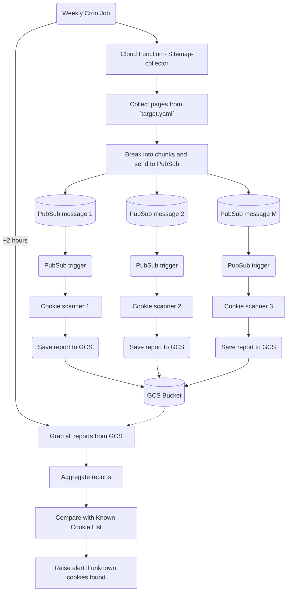

# Sentry Watchdog
Sentry took a stand of removing all 3rd party cookeis and trackers from our public websites in 2024.
- [We removed advertising cookies and here’s what happened - Matt Henderson](https://blog.sentry.io/we-removed-advertising-cookies-heres-what-happened/)
- [Navigating Cookies at Sentry: A Legal Perspective - Loretta Lau](https://blog.sentry.io/navigating-cookies-at-sentry-a-legal-perspective/)
- [Removing ad trackers and cookies - the technical perspective - Jeffrey Hung](https://blog.sentry.io/removing-ad-trackers-and-cookies-the-technical-perspective/)
- [Sentry Cookie Bounty](https://sentry.io/cookiebounty/)

Watchdog is a tool that we use to help us achieve the goal, it's a tool we use to scan for cookies and trackers on our public sites. Watchdog  built on top of [blacklight-collector from the Markup](https://github.com/the-markup/blacklight-collector/tree/main?tab=readme-ov-file). For more information about the `blacklight-collector` please read [their blog](https://themarkup.org/blacklight/2020/09/22/how-we-built-a-real-time-privacy-inspector).

## Configs

Scanner related configureation are defined in [scanner_config.yaml](./scanner_config.yaml) file, it will decide how scanner will scan your page, you can find a list of all the [available configurations here](https://github.com/the-markup/blacklight-collector/tree/main?tab=readme-ov-file#collector-configuration) for scanner related options. You can also control how many pages you want to scan simultaneously, how many pages each chunk should have. Default vaules will be used if configs are not provided.

You should adjust them accordingly, depends on how many pages you have and how much resource you want to spend on the cloud function.
```yaml
title: Sentry Cookie Scanner
scanner:
  headless: false
  numPages: 0
  captureHar: false
  saveScreenshots: false
  emulateDevice:
    viewport:
      height: 1920
      width: 1080
    userAgent: "Mozilla/5.0 (Windows NT 10.0; Win64; x64) AppleWebKit/537.36 (KHTML, like Gecko) Chrome/132.0.0.0 Safari/537.3"

# Note: pubsub message expires after 10 minutes, so we want to keep each chunk under 10 minutes
maxConcurrent: 40 # number of concurrent scans
chunkSize: 120 # number of pages to scan per chunk
```

[target.yaml](./target.yaml) is where you define the pages you want to scan, it can include sitemaps, rss feeds, or individual pages. 
```yaml
sitemaps:
  - https://sentry.io/sitemap/sitemap-0.xml
rss:
  - https://sentry.io/changelog/feed.xml
pages:
  - https://status.sentry.io
```

## Infrastructure
The infrastructure is build using the template from [secure-cloud-function-template](https://github.com/getsentry/secure-cloud-functions-template) using terraform.

Watchdog contains 3 cloud functions, each has their own readme file with more details
- [sitemap-collector](./functions/sitemap-collector/)
- [cookie-scanner](./functions/cookie-scanner/)
- [cookie-auditor](./functions/cookie-auditor/)

Besides cloud functions, terraform also creates [Pub/Sub Subscription and topic](./pubsubs/page-scanning-pubsub/) and a [GCS bucket](./gcs/aggregated_reports_storage/) for triggering events and storing reports.

### Flow


## Deployement

Update `terraform.tfvars` with your configs, make sure you are auth to GCP, then run the following to deploy the infrastructure and all the cloud functions.
You may need to re-run terraform apply several times to get everything deployed in place.

```
terraform init
terraform plan
terraform apply
```
