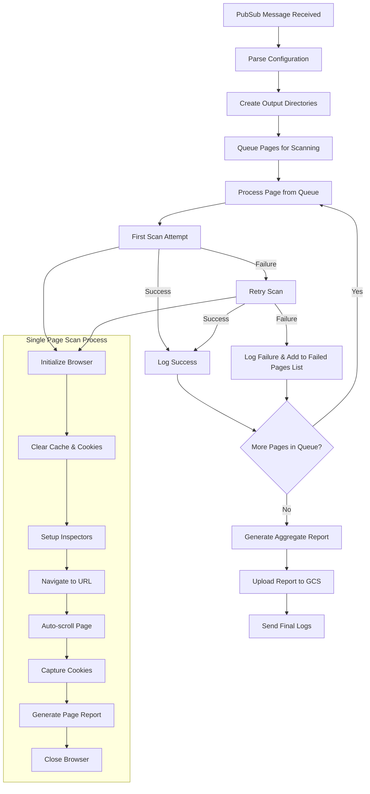

# Cookie Scanner

The cookie scanner is built on top of [Blacklight-collector](https://github.com/the-markup/blacklight-collector/tree/main?tab=readme-ov-file), with a wrapper around it that parse the sites to scan and scans them in batch.


## Input
An example input that will be send from pub/sub

```json
{
    "title": "Sentry Cookie Scanner",
    "scanner": {
        "headless": true,
        "numPages": 0,
        "captureHar": false,
        "saveScreenshots": false,
        "emulateDevice": {
            "viewport": {
                "height": 1920,
                "width": 1080
            },
            "userAgent": "Mozilla/5.0 (Windows NT 10.0; Win64; x64) AppleWebKit/537.36 (KHTML, like Gecko) Chrome/132.0.0.0 Safari/537.3"
        }
    },
    "maxConcurrent": 30,
    "chunkSize": 500,
    "total_pages": 3275,
    "total_chunks": 7,
    "chunk_no": 1,
    "target": [
        "https://page1.com",
        "https://page2.com",
        "https://page3.com",
        "https://page4.com"
    ]
}
```

## Output
An aggregated scan result for all the page scanned will be saved with the following format to the GCS bucket under the folder of the date the script ran.

```json
{
    "metadata": {
        "title": "Sentry Cookie Scanner",
        "date": "20250313/",
        "chunk_no": 1,
        "total_chunks": 29,
        "total_pages": 3480
    },
    "result": {
        "cookies": {
            "_GRECAPTCHA/www.google.com": [
                "https://blog.sentry.io/profiling-to-speed-up-your-apps/"
            ],
            "sentry-sc/sentry.io": [
                "https://sentry.io/changelog/slack-threads-for-issue-alerts",
                "https://sentry.io/changelog/stack-trace-local-variable-enhancements"
            ]
        },
        "fb_pixel_events": {},
        "key_logging": {},
        "session_recorders": {},
        "third_party_trackers": {
            "||plausible.io^$third-party": [
                "https://sentry.zendesk.com/hc/en-us/articles/21028096175259-Why-are-my-Alerts-not-Triggering-Understanding-When-conditions",
                "https://sentry.zendesk.com/hc/en-us/sections/26094954188059-Notifications"
            ],
            "||googletagmanager.com^": [
                "https://blog.sentry.io/a-new-era-of-sentry/",
                "https://blog.sentry.io/authors/johnny-bell/"
            ]
        }
    }
}
```

## Flow


## Logging
If you provide a webhook as logging destination in the [terraform.tfvars](../../terraform.tfvars) file, logs will be forward to the webhook destination. 
Authentication related token for logged is defined in GCP Secret manager, created in terraform [here](../../infrastructure/secrets.tf) and shared with the function in the [terraform.yaml](./terraform.yaml).