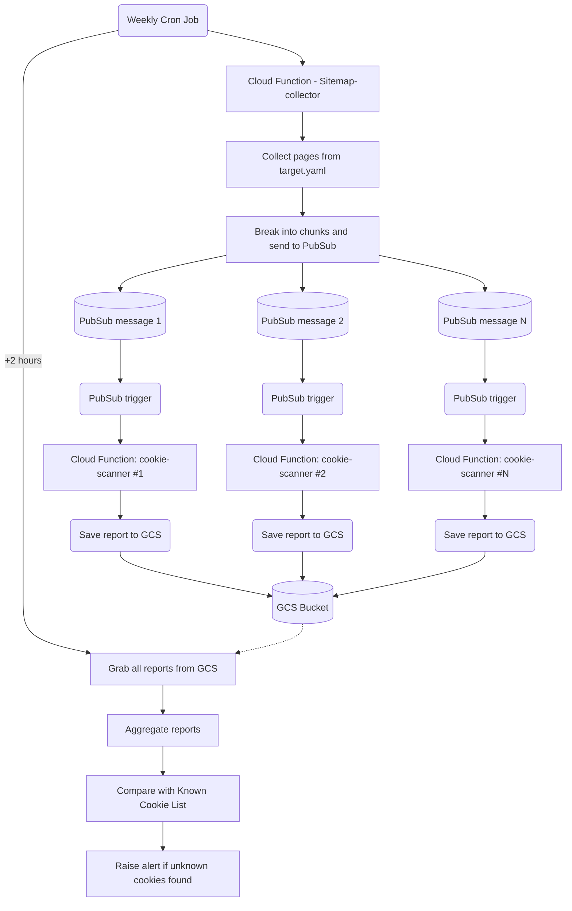

```mermaid
graph TD
		A(Weekly Cron Job) --> P
		P[Cloud Function - Sitemap-collector] --> B
    B[Collect pages from target.yaml]--> C
    C[Break into chunks and send to PubSub] 
    
    C --> E1@{ shape: cyl, label: "PubSub message 1"}
    C --> E2@{ shape: cyl, label: "PubSub message 2"}
		C --> E3@{ shape: cyl, label: "PubSub message N"}
		
    E1 --> Q1(PubSub trigger) -->F1[Cloud Function: cookie-scanner #1]
    E2 --> Q2(PubSub trigger) -->F2[Cloud Function: cookie-scanner #2]
    E3 --> Q3(PubSub trigger) -->F3[Cloud Function: cookie-scanner #N]

    F1 -->H1
    F2 -->H2
    F3 -->H3

    H1(Save report to GCS) -->I@{ shape: cyl, label: "GCS Bucket"}
    H2(Save report to GCS) -->I
    H3(Save report to GCS) -->I

    A --> | +2 hours| K
    I -.->K
    K[Grab all reports from GCS] -->L
    L[Aggregate reports] -->M
    M[Compare with Known Cookie List] -->N
    N[Raise alert if unknown cookies found]

```